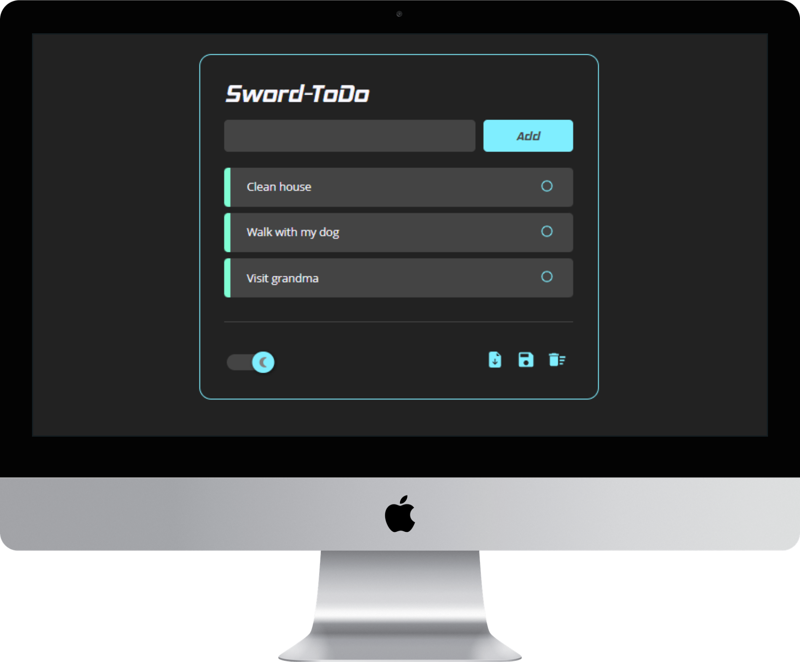
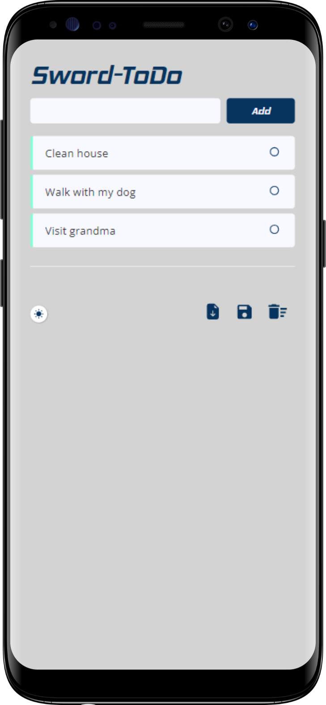

<br/>
<br/>

<p align=center>
    <a href='https://gabrieldp23.github.io/Sword-ToDo/'>
        
    </a>
</p>
<h1 align=center>Sword-ToDo</h1> 

<p align=center>
    <a href='https://gabrieldp23.github.io/Sword-ToDo'>Click here to view live project</a><br><br/>
    
    &nbsp;
    
    &nbsp;
    
</p>    

<br/>

<div align=center>
    
    &nbsp;&nbsp;&nbsp;&nbsp;&nbsp;
    
</div>

<br/>
<br/>

## 📘 Introduction

This project is part of the work of [SwordFish](https://www.instagram.com/swordfish.vca/) team to the F1 in Schools challenge.

A web todo list is a alternative more practical and sustainable than the use of hand-writting notes in stickers or notebook sheet, helping a lot the organization of the team.

The team decided to create the own tools to manage tasks and so Sword-ToDo was born.

<br/>

## ⚙ Functionalities

With a minimalist interface, Sword-ToDo is very intuitive, you'll quickly understand all.
### Main Page

Your start is here

|**Add tasks only with title**|
|:-|
|**Change task state of conclusion**|
|**Reorder tasks dragging (up or down)**|
|**Import/Export tasks (.json file)**|
|**Delete all tasks**|
|**Change app theme (light or dark)**|

---

### Task Details Editor

Click on a task and it will open the **Task Details Editor**

|**Edit task title**|
|:-|
|**Delete task**|
|**Change task color**|
|**Add a description**|
|**Define start and end dates**|

<br/>

## 🖥 Running locally

```bash
# Clone
git clone https://github.com/gabrieldp23/Sword-ToDo.git

# Node modules
npm install

# Open project on localhost
npm start
```

<br/>
<br/>

## &nbsp; SwordFish &nbsp;

🏎 F1 in Schools team of Escola Sesi Bahia

📌 Vitória da Conquista - BA

🏆 2nd place 2021 Nationals

⏳ 2022 World Finals will happen in May, wait for us...

<br/>

> *We believe that bringing knowledge from other areas into F1 in Schools project provides to the team members a huge professional growth. That's why we invest so much on programming tools for our team.*

<br/>

View more about our work:

<a href='https://www.instagram.com/swordfish.vca/'>
    
</a>