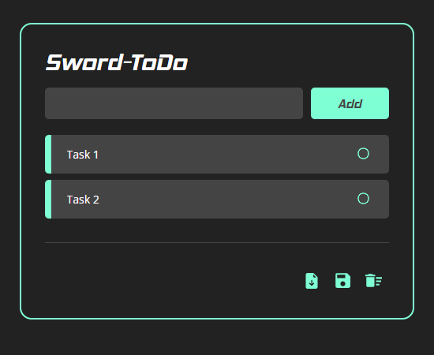
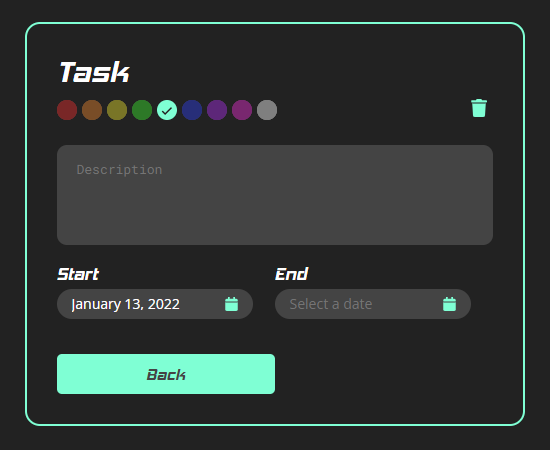

# Sword-ToDo 

<br/><br/>

<p align=center>
    
</p>

<p align=center>
    Sword-ToDo is a Web application made with React library.&nbsp;
    
</p>

<p align=center href='https://gabrieldp23.github.io/Sword-ToDo/'>
    Click here to go to website
</p>

<br/>

## Introduction

This project is part of the work of [SwordFish](https://www.instagram.com/swordfish.vca/) team to the F1 in Schools challenge.

A Web todo list is a alternative more practical and sustainable than the use of hand-writting notes in stickers or notebook sheet, helping a lot the organization of the team.

The team decided to create the own tools to manage tasks and so Sword-ToDo was born.

<br/>

## Functionalities

With a minimalist interface, Sword-ToDo is very intuitive, and you'll understand all quickly.
### 🏠 Main Page

<div>


Add a task ( just insert the name )

```
- Click on the checkbox to complete the task

- Drag a task up or down to reorder

- Import tasks from .json file 

- Export tasks to a .json file

- Delete all tasks
```
</div>

---

### 🖊 Personalizing the task

<div>


Click on a task and it will open the Task Details Editor

```
- Rename task title

- Delete task

- Change the task color 

- Add a description 

- Define start and end dates 
```
</div>

<br/>

## Open project

⚠ Not finished yet!
